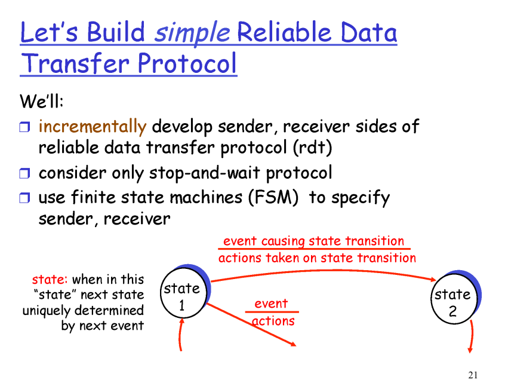
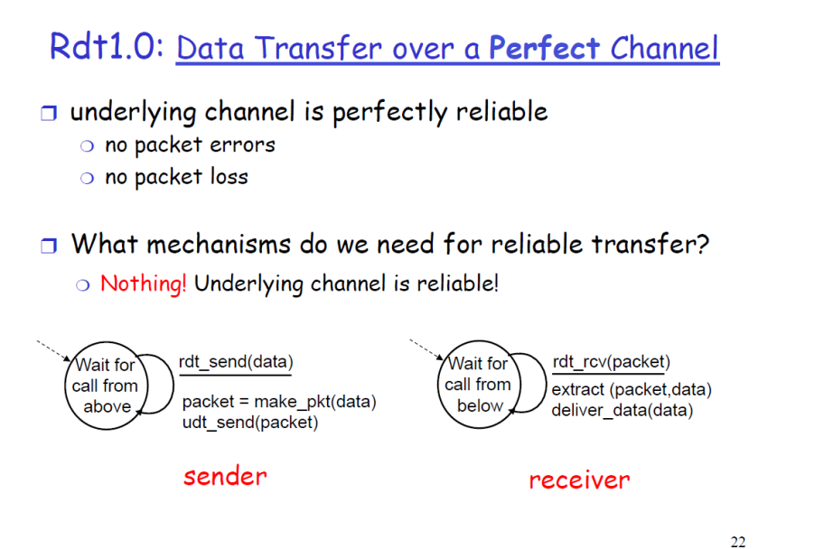
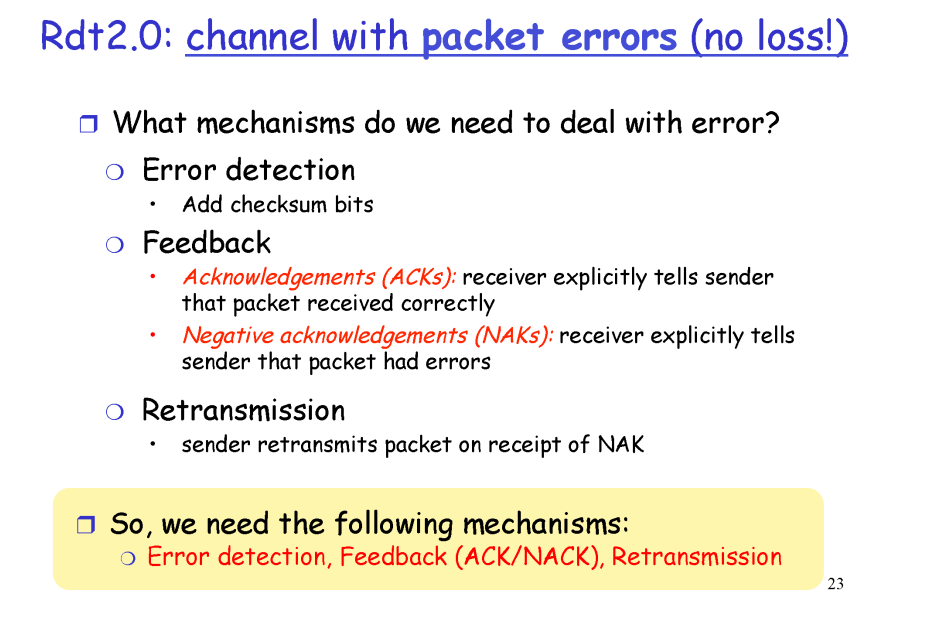
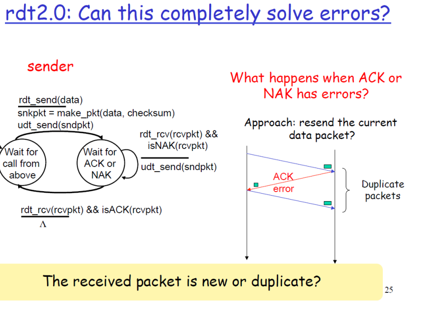
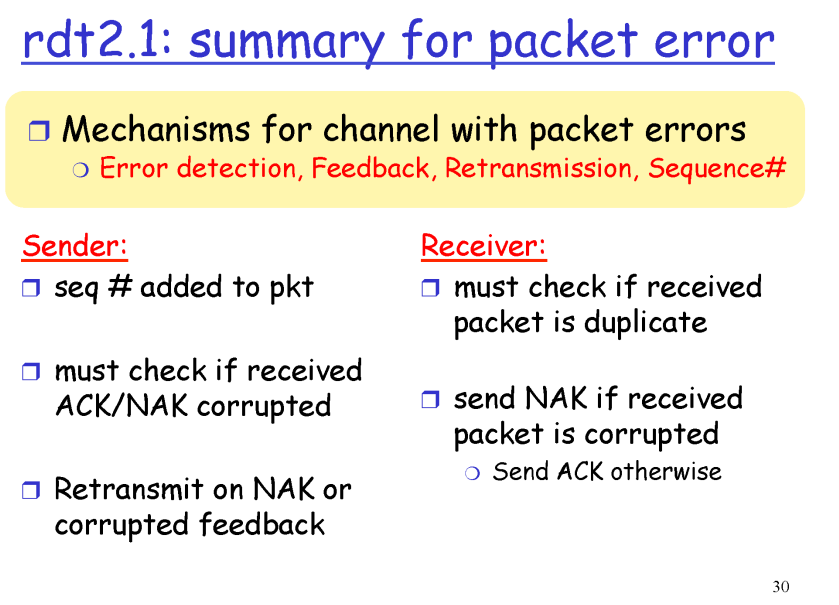
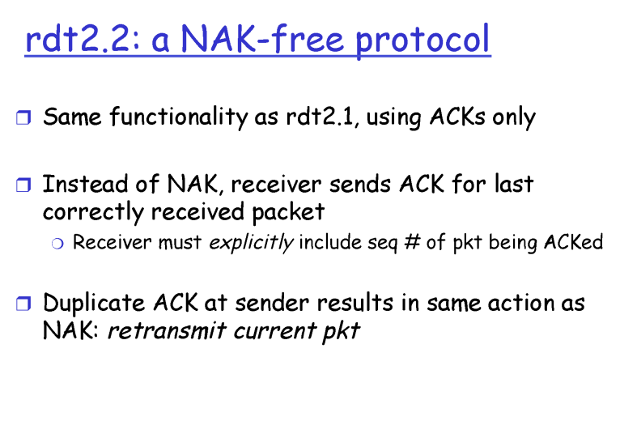
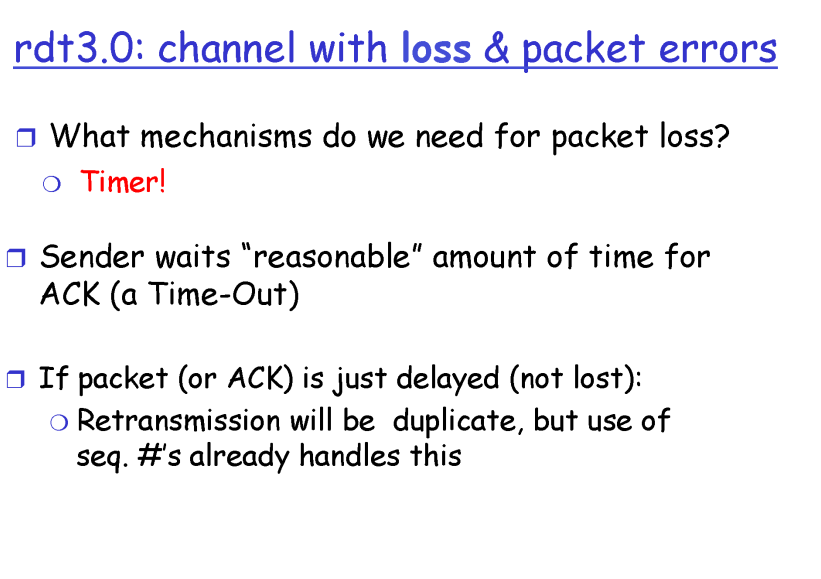
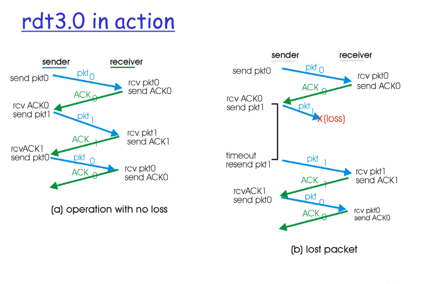
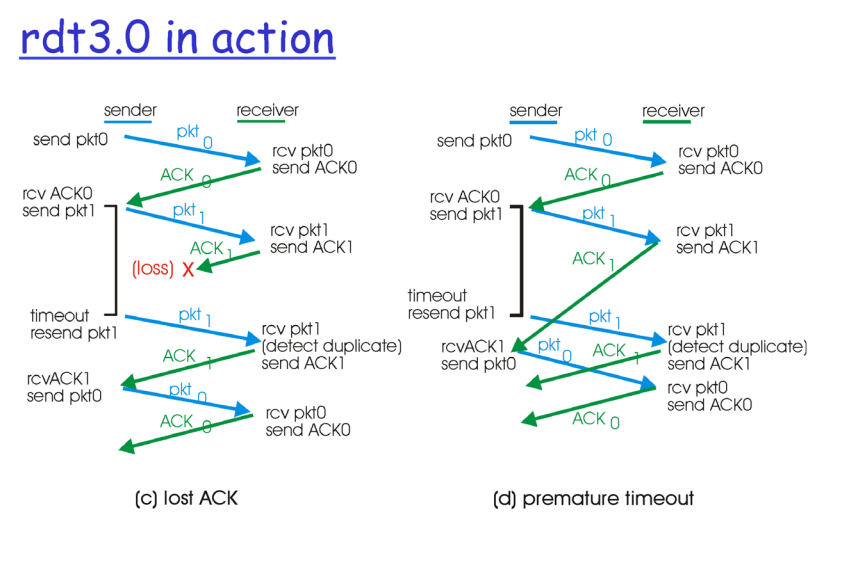
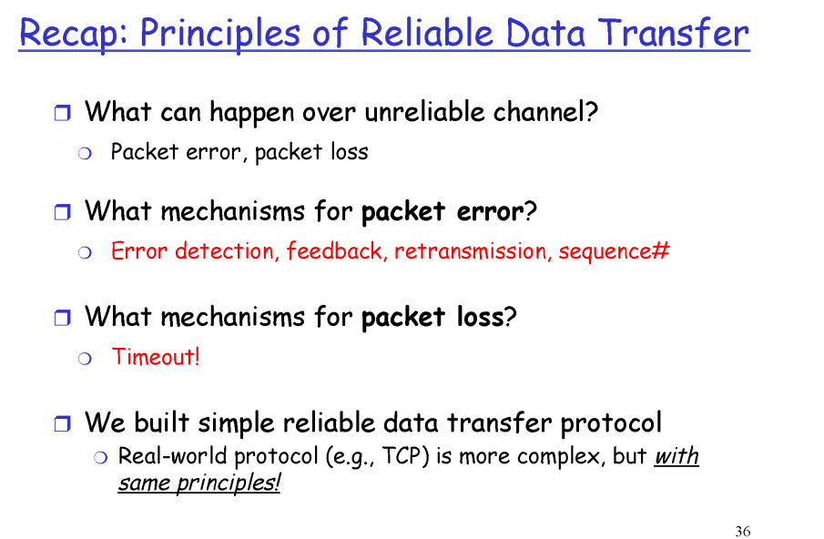

# 애플리케이션계층2

## Transport(TCP)
- reliable
- Transport 언더에는 unreliable하다
- unreliable 채널에는? -> 패킷 유실, 패킷 에러
- RDT protocol -> 패킷 하나씩 보내고 확인 -> 신뢰성

 

## RDT 1.0

## RDT 2.0
- Error detection
  - 보낸 패킷에 체크섬(헤더에)
  - 만약에 에러 -> 네거티브 피드백

- Feedback
  - 에러가 있든, 없든 피드백을 계속 줘야함
  - Acknowledgements(ACKs)
  - Negative acknowledgements(NAKs)

- Retransmission(재전송)

 

## 완벽하게 에러를 해결할 수 있는가?
- 만약에 피드백에 에러가 있다면?
- 가는 패킷에도 체크섬이 있어야하고 오는 패킷에도 체크섬이 있어야한다
- 다시 보낸다
- 리시버 입장에서는 새로운 패킷인지, 똑같은 패킷인지 알 수가 없다
- 해결방법? 시퀀스넘버 seq#

 

## RDT 2.1
- 시퀀스 넘버는 어디에? -> 헤더
- 단, 헤더가 커지면 커질수록 좋지 않다 -> 헤더 최소화
- 각 필드의 크기는 최소화해야함
- 시퀀스 넘버 크기는 2개로 가능

 

## RDT 2.2
- 리시버가 센더에게 ACK를 보내는데 시퀀스 넘버를 포함해서 보낸다
- NAK를 안쓴다

 

## RDT 3.0
- 만약에 메세지가 유실된다면?
- 타이머를 잰다
- 그럼 타이머를 얼마나 맞춰야하는가? -> 적당히(?)
- 짧으면 장점: 반응이 좋을 것 단점: 너무 빨라서 반복이 될 가능성이 높음
- 길면 장점: 반복이 될 가능성이 적음 단점: 반응이 느림
- 리시버가 반복적인 패킷을 버리기는 하지만 반복적인 건 문제가 될 수 있음

 

- RDT는 너무 기본적이다, 간단한다 
- 하나 보내고 하나 보내고를 시전
- 실제로는 한꺼번에 데이터를 마구잡이로 보내고 한번에 피드백

