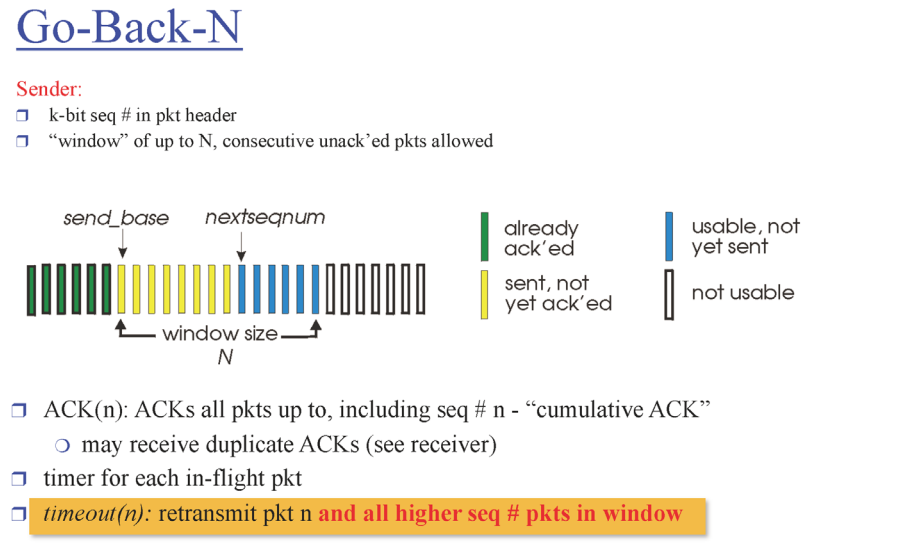
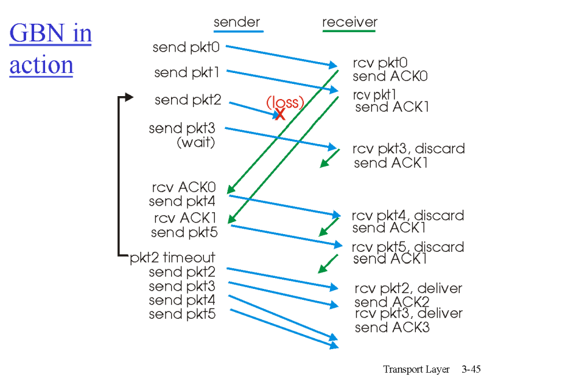
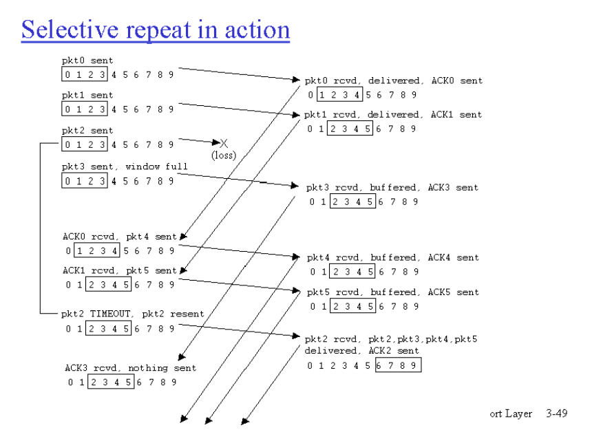

# 전송계층 1

## Go-Back-N
- 얼만큼 많이 보낼 것 인가에 대한 기준 -> window
- cumulative ACK -> 쌓아왔다? ex) ACK 11: 11번까지 잘받았다
- 타이머 -> window 안에 있는 것들 모두 재전송

- receiver는 무조건 다음 시퀀스의 넘버만 기다림
- 다음 패킷이 안오고 그 다음 패킷이 오고있다면 리시버에서 다 버림

- 윈도우 안에 있는 애들은 버퍼에 들고있음 -> 버퍼

 

## Selective Repeat
- 각각의 타이머
- 각각의 ACK

- ex) 2번이 유실되고 3,4,5가 왔을때 일단 3,4,5는 저장하고있음
  - ACK 3,4,5 보냄
  - 2번만 재전송
  - 나중에 2번을 제대로 받으면 2,3,4,5 한번에 통과
- ## dilemma: 
  - 헤더에 시퀀스 넘버 -> 작으면 작을 수록 좋음 -> 재활용하는 것이 좋음
  - 0,1,2,3을 쓸 때 0이 3다음것이라고 생각하고 저장할 수가 있음
  - 해결 방법: 시퀀스 넘버의 범위를 늘리면 됨
  - 윈도우 사이즈와 어떻게 관계를 해야하나?
  