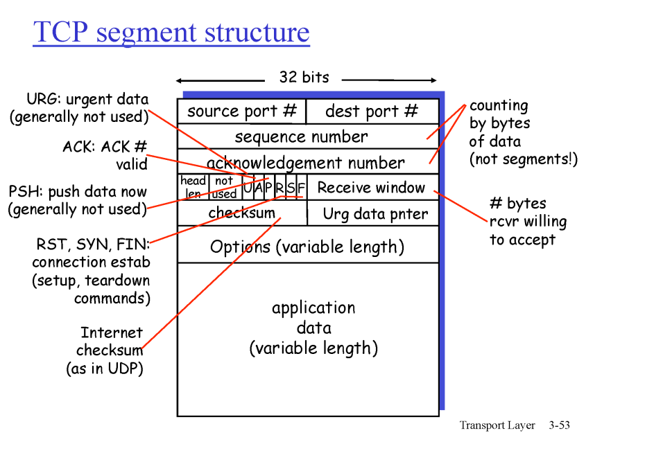
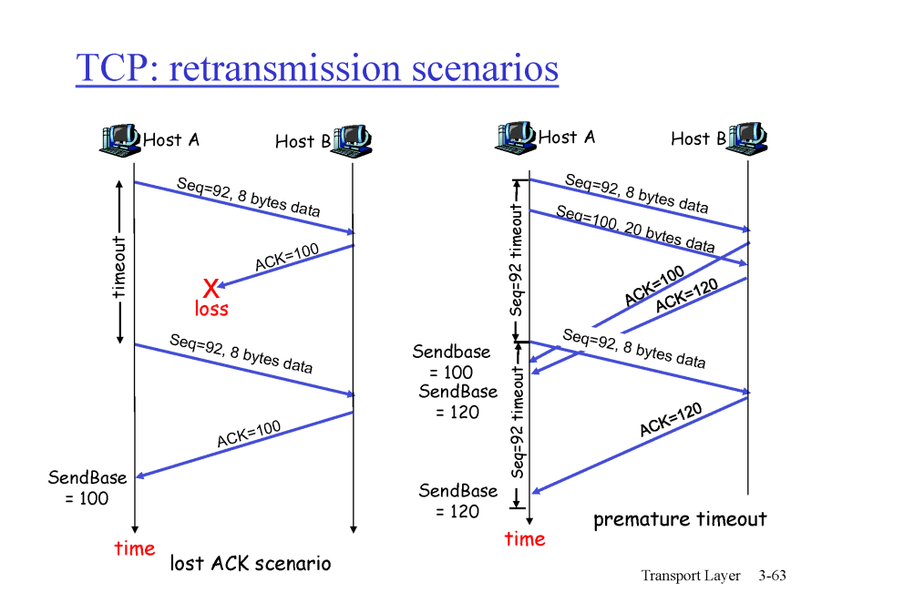

# 전송계층 2

## TCP
- point-to-point
  - 하나의 소켓과 하나의 소켓끼리의 통신
- reliable, in-oreder byte stream
- full duplex data
  - 데이터가 양방향으로 진행
- send & receive buffers
- flow controlled
  - 리시버의 소화능력에 맞게 그 양을 맞춰 보내는 것

## TCP segment structure

 

## TCP seq. #'s and ACKs
- Seq => 데이터 번호 보낸다 
- ACK => 여기서부터 보내라(기다린다)
- 데이터인지 echo인지를 구분하는 것은 data를 봐야됨

 

## Timeout -- function of RTT
- 출발지에서 목적지까지 갔다가 다시 출발지로 돌아오는데 걸리는 총 시간
- RTT 값은 다 다르다
- 큐잉 딜레이 등 때문에
- 그래서 나온 값이 EstimatedRTT(보정한 RTT)
- TimeoutINterval = EstimatedRTT + 4*DevRTT

 

## TCP reliable data transfer
- 파이프라인 방식
- 타이머 하나(GO-Back N) 
  차이점: 그거에 해당하는 세그먼트만 재전송
- 기다렸다가 ACK해라
- Fast retransmit: time out이 되기전에 미리 loss난 것을 보내는 것
